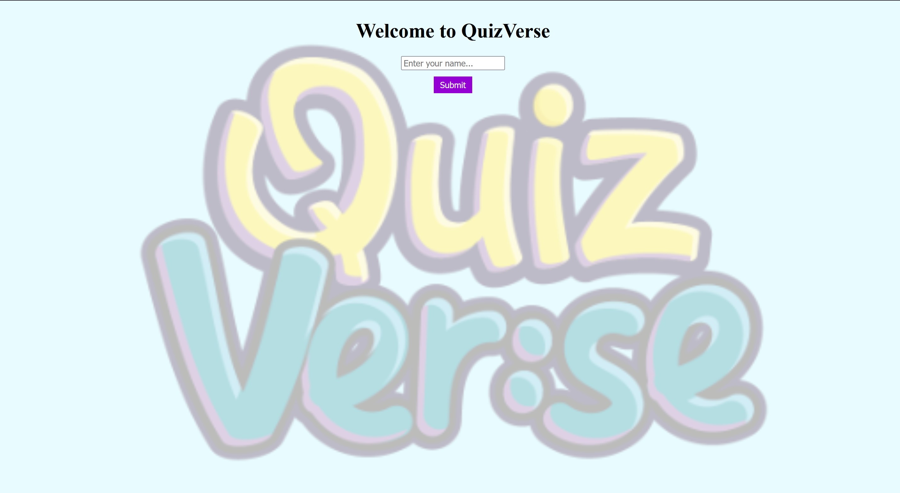
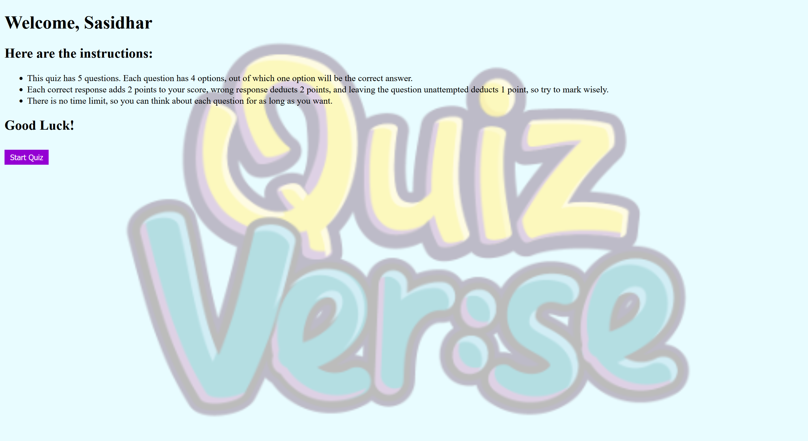
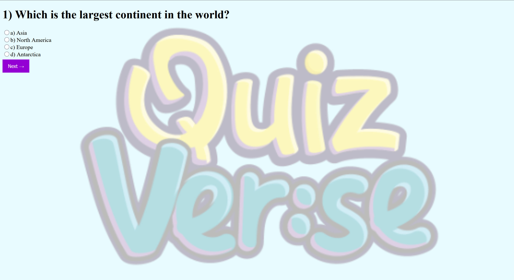
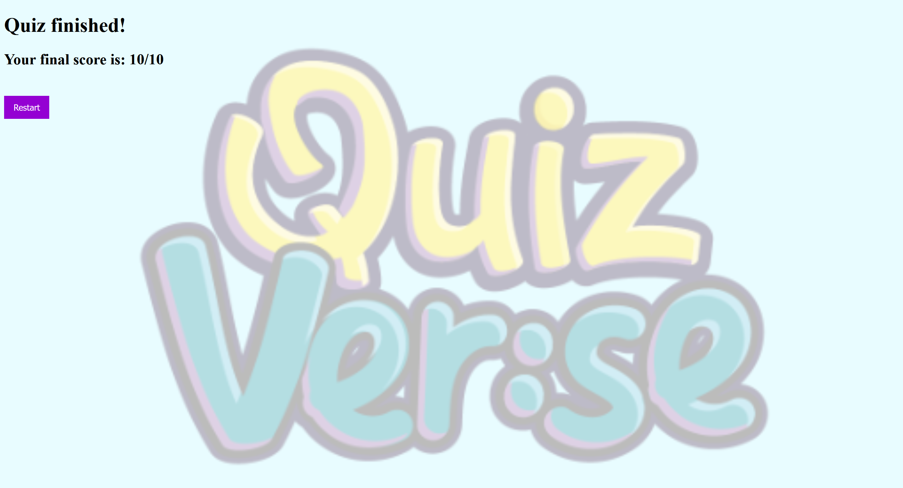

# QuizVerse

## Description

This project is a simple quiz website which has 5 questions and lets the users play it by selecting an option from a set of 4 options. I built this project to improve my web development skills.

## Visuals

## How To Run This Project

This project needs to be run from a local server for the welcome screen to work.

1. Download the "Live Server" extension in VS Code.
2. Clone this repository on your local machine and open it in VS code.
3. Right-click on index1.html file and click on "Open with Live Server".
